<div align="center">

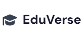

# EduVerse


### A Full-Stack E-Learning & Online Bookstore Platform

A modern full-stack web application that combines an **E-Learning Platform** and an **Online Bookstore** into a single integrated solution.

Students can enroll in courses, purchase digital books, access learning resources, participate in quizzes, and track their learning progress through a secure and user-friendly interface. The platform also provides dedicated dashboards for administrators and teachers to efficiently manage educational content and users.


</div>

---

#  Overview

EduVerse is a modern full-stack web application designed to provide a seamless digital learning experience by integrating an online learning platform with a digital bookstore.

The platform enables users to enroll in online courses, purchase digital books, access educational resources, participate in quizzes, track learning progress, and manage their profiles securely.

Built using **React**, **Node.js**, **Express.js**, and **MySQL**, EduVerse follows a scalable client-server architecture that separates the frontend, backend, and database for better maintainability and performance.

---

#  Key Features

##  Authentication

* User Registration
* Secure Login
* Session-based Authentication using Cookies
* JWT Authentication
* Password Hashing using bcrypt
* Protected Routes
* Role-Based Access Control

---

##  Student Module

* Browse Courses
* Course Enrollment
* Purchase Digital Books
* Shopping Cart
* Search Courses
* Filter Courses
* Category-wise Browsing
* Student Profile
* Quiz Module
* Review & Rating System
* Progress Tracking

---

##  Teacher Module

* Teacher Dashboard
* Course Management
* Student Monitoring

---

##  Administrator Module

* Admin Dashboard
* User Management
* Category Management
* Course Management
* Book Management

---

##  Payment Module

* Demo Payment Integration

---

##  Security Features

* Cookie-based Sessions
* JWT Authentication
* Password Encryption
* Protected API Routes

---

#  Technology Stack

## Frontend

| Technology   | Purpose               |
| ------------ | --------------------- |
| React        | User Interface        |
| Vite         | Build Tool            |
| JavaScript   | Programming Language  |
| HTML5        | Markup                |
| CSS3         | Styling               |
| Bootstrap    | UI Components         |
| Tailwind CSS | Utility-first Styling |
| Redux        | State Management      |
| Axios        | API Requests          |
| React Router | Client-side Routing   |

---

## Backend

| Technology    | Purpose             |
| ------------- | ------------------- |
| Node.js       | Runtime Environment |
| Express.js    | Backend Framework   |
| JWT           | Authentication      |
| bcrypt        | Password Hashing    |
| Cookie Parser | Cookie Handling     |
| Multer        | File Uploads        |

---

## Database

| Technology        | Purpose             |
| ----------------- | ------------------- |
| MySQL             | Relational Database |
| Stored Procedures | Database Logic      |
| Triggers          | Automation          |
| Views             | Data Abstraction    |

---

## Development Tools

* Git
* GitHub
* VS Code
* Postman

---

#  System Architecture

```text
                    React + Vite
                          │
                     Axios Requests
                          │
                          ▼
                 Node.js + Express API
                          │
               JWT + Cookies + Sessions
                          │
                          ▼
                   MySQL Database
```

---

# 📂 Project Structure

```text
EduVerse/
│
├── API/
│   ├── controllers/
│   ├── routes/
│   ├── middleware/
│   ├── config/
│   ├── models/
│   ├── uploads/
│   ├── package.json
│   ├── .env.example
│   └── README.md
│
├── UI/
│   ├── public/
│   ├── src/
│   ├── package.json
│   ├── .env.example
│   └── README.md
│
├── DB/
│   ├── schema.sql
│   ├── procedures.sql
│   ├── triggers.sql
│   ├── views.sql
│   └── README.md
│
├── Documentation/
│   ├── logo.png
│   ├── EDUVERSE-FINAL YEAR PROJECT REPORT.pdf
│   ├── FINAL YEAR PROJECT PPT.pptx
│   ├── Screenshots/
│   └── README.md
│
├── .gitignore
├── LICENSE
├── CONTRIBUTING.md
├── CHANGELOG.md
└── README.md

```
---

---

#  Getting Started

Follow the steps below to set up the project on your local machine.

## Prerequisites

Make sure the following software is installed:

* Node.js (Latest LTS Version)
* npm
* MySQL Server
* Git
* Visual Studio Code

---

# ⚙️ Installation

## 1. Clone the Repository

```bash
git clone https://github.com/ajaykrsingh7/EduVerse.git
cd EduVerse
```

> Replace the repository name above if you rename it in the future.

---

## 2. Backend Setup

```bash
cd API
npm install
```

Start the backend server:

```bash
npm start
```

> If your project uses Nodemon instead of `npm start`, use:

```bash
npm run dev
```

---

## 3. Frontend Setup

Open another terminal.

```bash
cd UI
npm install
npm run dev
```

---

#  Environment Variables

Create a `.env` file inside the **API** folder.

Example:

```env
PORT=5000

DB_HOST=localhost
DB_PORT=3306
DB_USER=your_username
DB_PASSWORD=your_password
DB_NAME=eduverse

JWT_SECRET=your_jwt_secret

SESSION_SECRET=your_session_secret
```

> Do **not** upload your `.env` file to GitHub. Use `.env.example` to document the required variables.

---

# Database Setup

1. Install MySQL Server.
2. Create a new database.
3. Import the SQL files available in the **DB** folder.
4. Update your database credentials in the `.env` file.
5. Start the backend server.
6. Start the frontend application.

---

#  Application Screenshots

##  Home Page

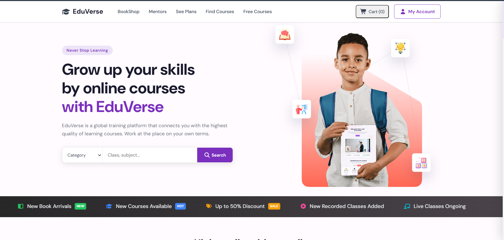

---

## Login

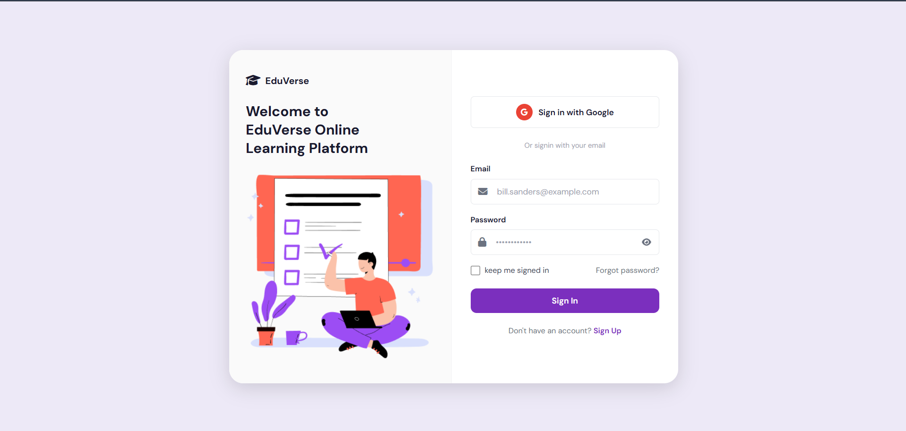

---

##  Sign Up

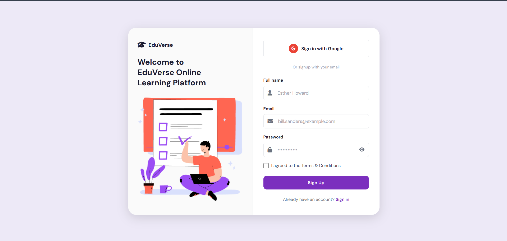

---

##  Free Courses

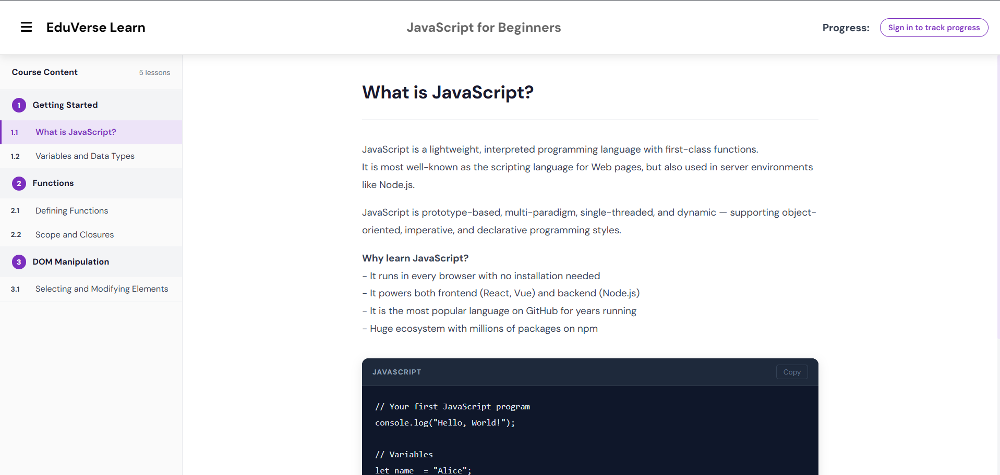

---

##  Courses

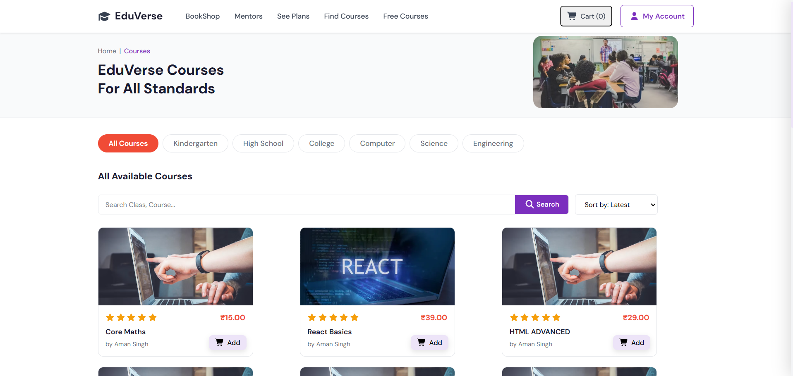

---

##  Book Store

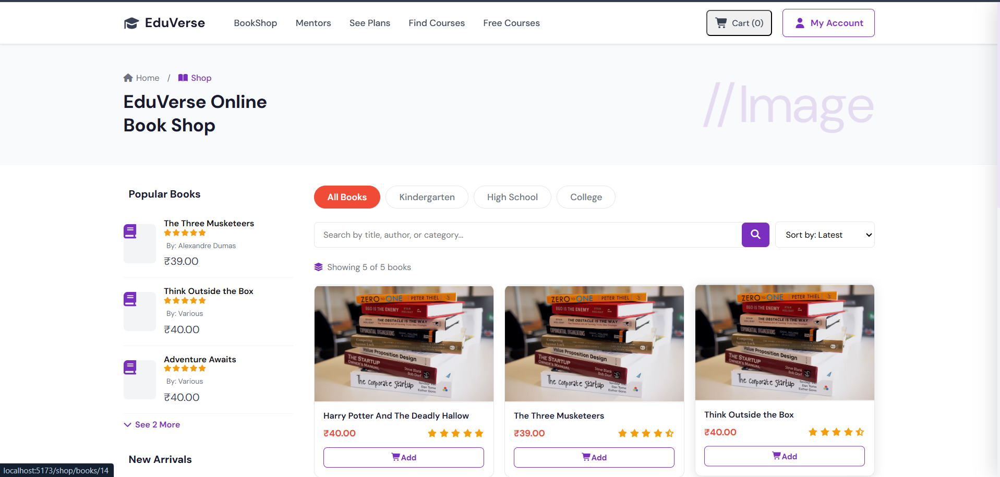

---

##  Admin Dashboard

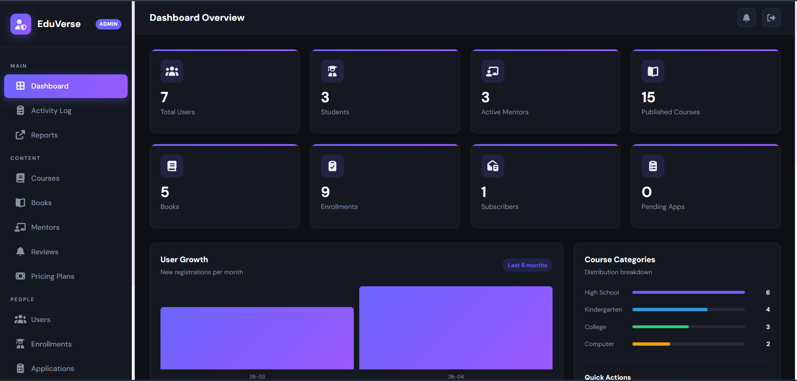

---

##  User Profile

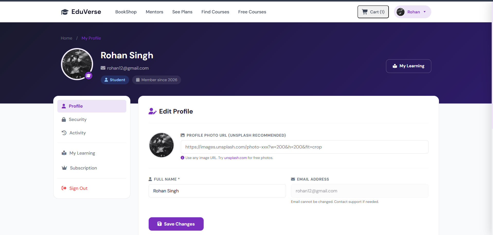

---

##  Payment

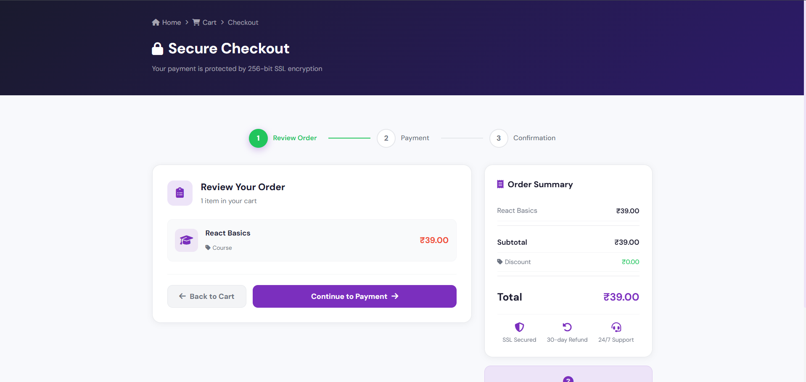

---

##  Mentor

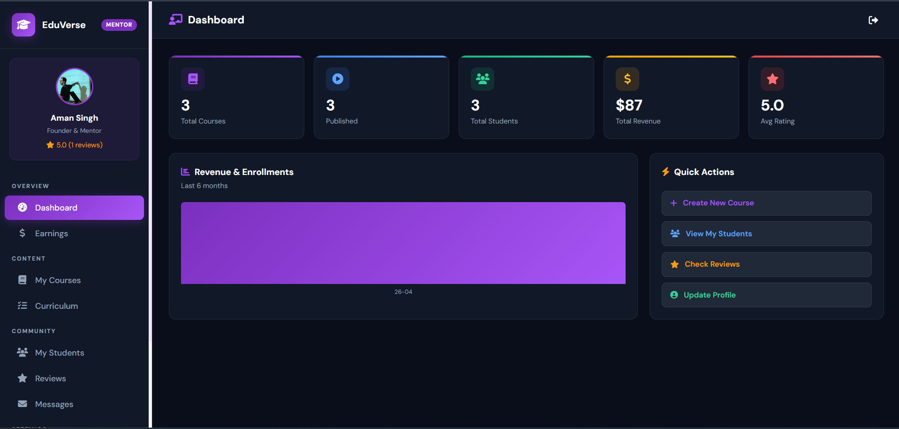

---

Suggested screenshots:

| Module          | Screenshot            |
| --------------- | --------------------- |
| Home Page       | `Home.png`            |
| Login           | `Login.png`           |
| Signup          | `SignUp.png`          |
| FreeCourses     | `FreeCourses.png`     |
| Course Page     | `Courses.png`         |
| Book Store      | `BookShop.png`        |
| Admin Dashboard | `Admin.png`           |
| Student Profile | `UserProfile.png`     |
| Mentor          | `Mentor.png`          |
| Payment         | `Payment.png`         |

> After uploading the screenshots, you can display them directly in this README using Markdown image links.

---

#  Project Documentation

The **Documentation** folder contains all project-related documents, resources, and supporting materials.

##  Contents

-  **Final Year Project Report**
  - Complete project documentation and technical details.

-  **Project Presentation (PPT)**
  - Final year project presentation slides.

-  **Project Logo**
  - Official EduVerse project branding assets.

-  **Application Screenshots**
  - Screenshots of different modules and user interfaces.

-  **Team Information**
  - Contributor details and team member profiles.

-  **Additional Diagrams**
  - System architecture, database diagrams, and other supporting diagrams (if available).

---

#  Project Modules

### Authentication Module

* Login
* Registration
* Session Management
* Authorization

### Student Module

* Course Enrollment
* Digital Book Purchase
* Quiz
* Progress Tracking

### Teacher Module

* Course Management
* Student Monitoring

### Admin Module

* User Management
* Category Management
* Course Management
* Book Management

---

#  Future Enhancements

* Real Payment Gateway Integration
* Email Verification
* Certificate Generation
* AI-Based Course Recommendation
* Wishlist
* Mobile Application
* Live Notifications
* Dark Mode
* Video Progress Resume
* Multi-language Support

---

#  Contributors

<table>
<tr>

<td align="center">
<br>
<b>Ajay Kumar Singh</b><br>
27600122119
</td>

<td align="center">
<br>
<b>Aman Singh</b><br>
27600122120
</td>

<td align="center">
<br>
<b>Himansu Kumar Singh</b><br>
27600122031
</td>

<td align="center">
<br>
<b>Saksham Gupta</b><br>
27600122181
</td>

<td align="center">
<br>
<b>Rishu Raj</b><br>
27600122186
</td>

</tr>
</table>

---

#  Academic Guide

<div align="center">


<br>

<b>Mr. Jyotipriyo Khanra</b>

<br>

Project Guide

<br>

Budge Budge Institute of Technology

</div>

---

#  Academic Information

| Item          | Details                                                       |
| ------------- | ------------------------------------------------------------- |
| Project       | EduVerse                                                      |
| Project Type  | Final Year Project                                            |
| College       | Budge Budge Institute of Technology                           |
| University    | Maulana Abul Kalam Azad University of Technology, West Bengal |
| Academic Year | 2022 - 2026                                                   |

---

#  Contributing

Contributions, suggestions, and improvements are welcome for educational purposes.

If you would like to contribute:

1. Fork the repository.
2. Create a new branch (git checkout -b feature/NewFeature).
3. Make your changes.
4. Commit your changes (git commit -m "Add new feature").
5. Push the branch (git push origin feature/NewFeature).
6. Create a Pull Request.

All contributions should maintain clean code practices and proper documentation.

---

##  License

This project has been developed for **educational and academic purposes only** as part of the Final Year Project.

The source code and documentation are provided for learning and demonstration purposes.

Any commercial usage, redistribution, or modification requires permission from the project contributors.

#  Acknowledgements

We would like to express our sincere gratitude to everyone who supported us throughout the development of this project.

Special thanks to:

- **Mr. Jyotipriyo Khanra**  
  Project Guide, Budge Budge Institute of Technology

- **Budge Budge Institute of Technology**
  for providing the academic environment and resources required for project development.

- **Maulana Abul Kalam Azad University of Technology, West Bengal**
  for providing the academic framework and guidance for this Final Year Project.

We also acknowledge the open-source community and developers whose tools and technologies helped us build this application.

---

<div align="center">

## Thank You for Visiting EduVerse.

If you found this project interesting, consider giving it a star ⭐ on GitHub.

Made with ❤️ by the EduVerse Team.

</div>

---
